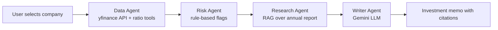
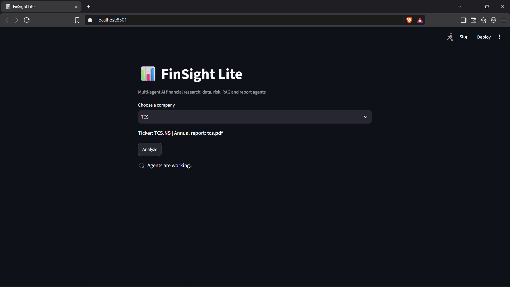
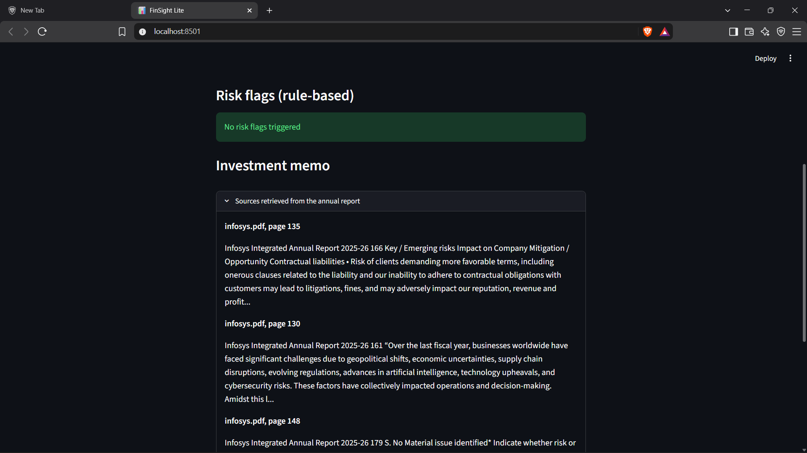
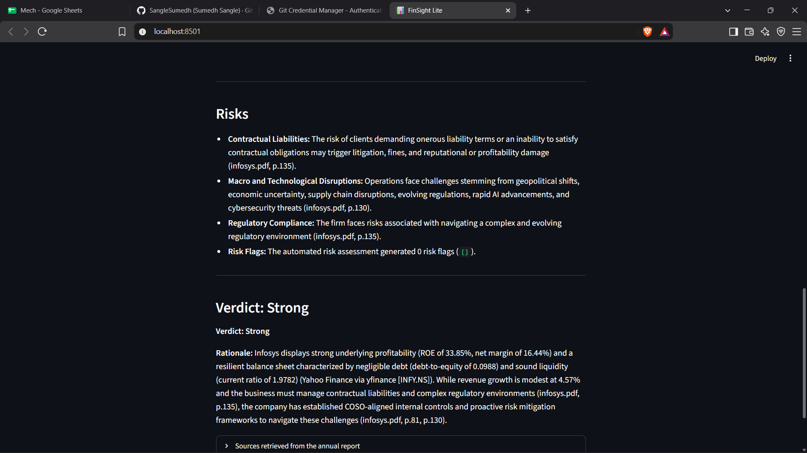
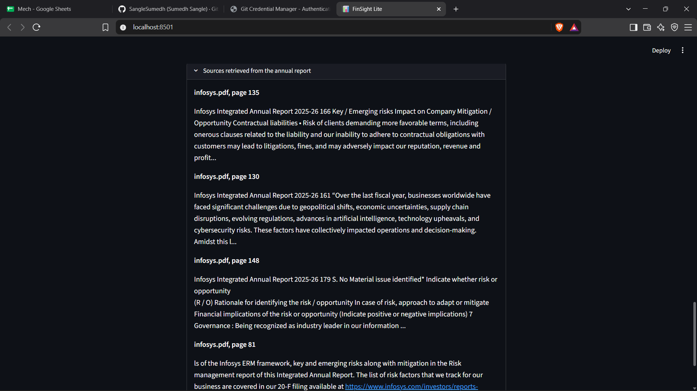

# FinSight Lite: Multi-Agent AI Financial Research Analyst

FinSight Lite turns a company name into an analyst-style investment memo. A small team of AI agents fetches market data, calculates financial ratios, flags risks, searches the company's annual report, and writes a memo with page-level citations.

Built with Python, LangGraph, the Gemini API, ChromaDB, yfinance and Streamlit.

## Problem

Reading annual reports and calculating ratios by hand takes analysts hours. Small businesses and startups often have no time or budget for it. FinSight Lite automates the first draft of that work, so a human can review it and decide.

## Key Design Decisions

- **The LLM never does math.** Net margin, ROE, debt-to-equity, current ratio and revenue growth are calculated by unit-tested Python functions. The LLM only explains the numbers it is given.
- **Rule-based risk flags.** Risk rules (for example, debt-to-equity above 2) are plain code, so they are predictable and explainable.
- **Cited answers.** Every retrieved passage keeps its source file and page number, and the memo cites them, for example `(infosys.pdf, p.135)`.
- **Per-company retrieval.** The vector search filters by report file, so a TCS memo only cites `tcs.pdf` and an Infosys memo only cites `infosys.pdf`.

## Architecture



| Agent | What it does |
|---|---|
| Data Agent | Fetches financial statements from Yahoo Finance and calculates ratios with tested Python functions |
| Risk Agent | Applies rules: high leverage, liquidity risk, thin margins, declining revenue |
| Research Agent | Searches the company's annual report (ChromaDB embeddings) and returns passages with page numbers |
| Writer Agent | Writes the memo from the ratios, flags and report passages only |

## Features

- Company dropdown (Infosys, TCS) with automatic ticker and report selection
- Ratios table: net margin, ROE, debt-to-equity, current ratio, revenue growth
- Rule-based risk flags
- Investment memo: Business Overview, Financial Health, Risks, Verdict
- Expandable list of the report passages used as sources
- Unit tests for the ratio calculations
- Evaluation script that checks the memos automatically

## Tech Stack

Python, LangGraph, LangChain, Google Gemini API, ChromaDB, pypdf, yfinance, Streamlit, pytest, Git and GitHub.

## Screenshots

| Home and ratios | Investment memo |
|---|---|
|  |  |

| Risk section | Sources |
|---|---|
|  |  |

## Project Structure

```
Finsight-Lite/
├── app.py               # Streamlit interface
├── evaluate.py          # Automated evaluation script
├── agents/
│   └── graph.py         # LangGraph workflow and agents
├── tools/
│   ├── ratios.py        # Financial ratio functions
│   ├── financials.py    # Yahoo Finance data tool
│   └── rag.py           # PDF ingestion and vector search
├── tests/
│   └── test_ratios.py   # Unit tests
├── data/                # Annual report PDFs (not committed)
└── screenshots/
```

## Setup (Windows)

1. Clone the repository:
   ```
   git clone https://github.com/piyushnande2004/Finsight-Lite.git
   cd Finsight-Lite
   ```
2. Create and activate a virtual environment:
   ```
   python -m venv venv
   .\venv\Scripts\Activate.ps1
   ```
3. Install the packages:
   ```
   pip install langgraph langchain-google-genai yfinance chromadb pypdf fonttools streamlit pytest python-dotenv
   ```
4. Create a `.env` file in the main folder:
   ```
   GOOGLE_API_KEY=your_key_here
   MODEL=your_gemini_flash_model_name
   ```
   Get a free key at [aistudio.google.com](https://aistudio.google.com). Gemini model names change over time, so copy a current Flash model name from AI Studio.
5. Download the annual reports from each company's investor page and save them in `data/` as `infosys.pdf` and `tcs.pdf`. The file name must be the company name in lowercase.
6. Load the reports into the vector database (run once per report, takes a few minutes):
   ```
   python -c "from tools.rag import ingest; ingest('data/infosys.pdf')"
   python -c "from tools.rag import ingest; ingest('data/tcs.pdf')"
   ```
7. Run the app:
   ```
   streamlit run app.py
   ```

## Run the Tests

```
python -m pytest
```

## Evaluation

`evaluate.py` runs the full pipeline for each company and checks four things:

1. All five ratios were fetched.
2. The memo cites the correct company's report.
3. The memo's numbers match the code-calculated ratios.
4. A verdict (Strong, Neutral or Weak) is present.

**Results:** 8/8 checks passed (100%) on 2 companies (Infosys and TCS), average time per report 36.8 seconds. Full table in [EVAL.md](EVAL.md).

## Limitations

- Only two companies (Infosys and TCS) are supported, because each needs its annual report loaded.
- Ratios come from Yahoo Finance through yfinance, which can have missing or delayed data.
- The workflow is a fixed pipeline of four agents, not a planner that chooses its own steps.
- Report search uses fixed-size text chunks, which can split a sentence across two chunks.
- The free Gemini tier has a daily request limit, so heavy testing can hit it.
- The memo is a first draft for a human to review. It is not investment advice.

## Future Work

- Planner agent that decides which tools to run for each question
- More companies, and a peer-comparison agent
- Expose the ratio tool as an MCP server
- Store financial data in SQL
- Docker packaging and cloud deployment
- Smarter chunking and an evaluation set with known correct answers

## Author

Piyush Nande | [GitHub](https://github.com/piyushnande2004) | [LinkedIn](https://linkedin.com/in/piyush-nandea7506a2a1)
